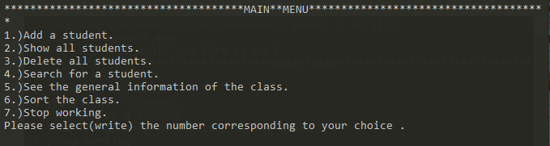
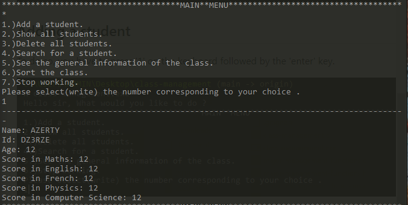
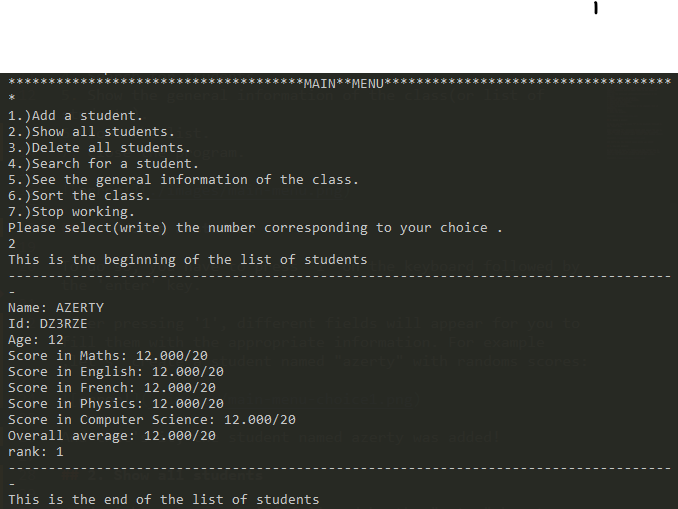
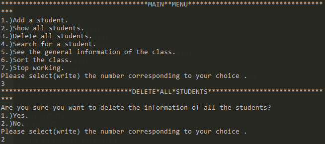
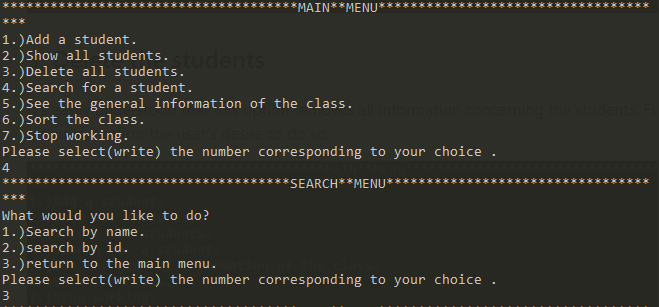
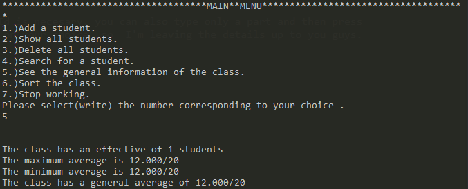
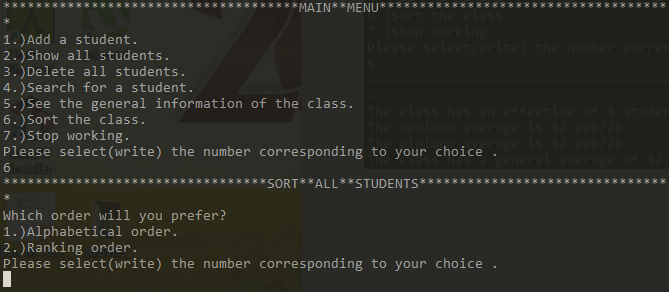
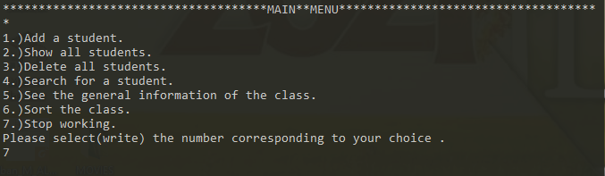

# Class-Management Project

First of all, forgive me for the commit messages that are in french.

This is to help you understand the differents functionalities of the project.
As the name implies the aim of the project is to manage a class of students with no limit concerning the effective of the class.

First of all, I'm going to do a summarised explanation about the program, so don't expect me to go into details like sub- menus and the effects of the sub-choices. This is because this because this program is too large(for a student in college) and so I don't want to waste time.

Here are the main options(functionalities) of the program:
1. Add(or create) a new student.
2. Show all the different students.
3. Delete all the students.
4. Search for students.
5. Show the general information of the class(or list of students).
6. Sort the list.
7. Close the program.

## 1. Adding a Student

To do so, you have to press '1' on the keyboard followed by the 'enter' key.

After pressing '1', different fields will appear for you to fill them with the appropriate information. For example ,let's  create a student named "azerty" with randoms scores:

And that's it, the student named azerty was added!

## 2. Show All Students

We just have to press '2' followed by the "enter" key to obtain a display of the students information. Here we can also see the student's current rank and his average.

## 3. Delete the Students

It's easily understood that this option removes all information concerning the students. Furthermore, I added mini-menu to confirm the user's desire to do so.  

## 4. Search a Particular Student

It's possible to Search with a name or with an Id. Not all the name or Id is necesary, you can also type only a part and then press the "enter" key to launch the search. There a few sub-options depending on your choice  so  I'm leaving the details up to you guys.

## 5. Display the General Information of the Class
The header is obvious so no further explanation is necesary.

## 6. Sort the Students
Its possible to sort by name  or by rank.

## 7. Quit the Program
You can do this when you're done with your work.

